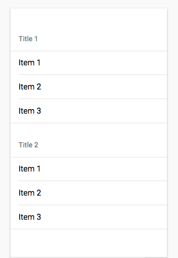

# morph-list-view-title
Title component for list view

## Getting Started:
For the information about how to clone the desired repository, running the local server and testing, please refer to this [link](https://github.com/moduware/polymorph-components/blob/master/INFO.md).

## Demo

- Here is a quick demo of the `morph-list-view-title` element for **IOS platform**.

  <p align="center">
    
  </p>

- Here is a quick demo of the `morph-list-view-title` element for **Android platform**.

  <p align="center">
    
  </p>

- Here is the HTML markup for both **IOS** and **Android** platform

```html

<template>
  <morph-list-view>
    <morph-list-view-title>Title 1</morph-list-view-title>

    <morph-list-view-item>Item 1</morph-list-view-item>
    <morph-list-view-item>Item 2</morph-list-view-item>
    <morph-list-view-item>Item 3</morph-list-view-item>

    <morph-list-view-title>Title 2</morph-list-view-title>

    <morph-list-view-item>Item 1</morph-list-view-item>
    <morph-list-view-item>Item 2</morph-list-view-item>
    <morph-list-view-item>Item 3</morph-list-view-item>
  </morph-list-view>
</template>

```